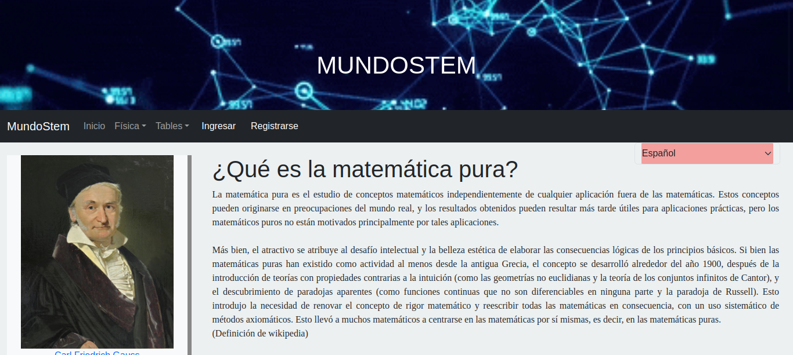

# 🌐 MundoStem Frontend - Execution Instructions

This document provides instructions on how to run the **MundoStem** application. The project uses **PostgreSQL** as the database and is divided into two parts: the backend and the frontend. You can find the backend in the [MundoStem Backend Repository](https://github.com/DavidOlmos03/mundoStemBackendv2/tree/main).

---

This project was generated with [Angular CLI](https://github.com/angular/angular-cli) version **16.0.1**.

---

## 🚀 Running the Application

To run the **MundoStem** application, follow these steps carefully. You will need to run both the **backend** and the **frontend** to use the application.

### 🛠 Prerequisites
- [Node.js](https://nodejs.org/) installed on your system.
- [Angular CLI](https://angular.io/cli) installed globally.
- Docker (optional for database setup).

---

### ⚙️ Steps to Run

1. **🌐 Start `mundostem`:**
   ```bash
   npm start
2. 📂 Open the application in your browser: Navigate to
   ```bash
   http://localhost:4200/
   ```

---

